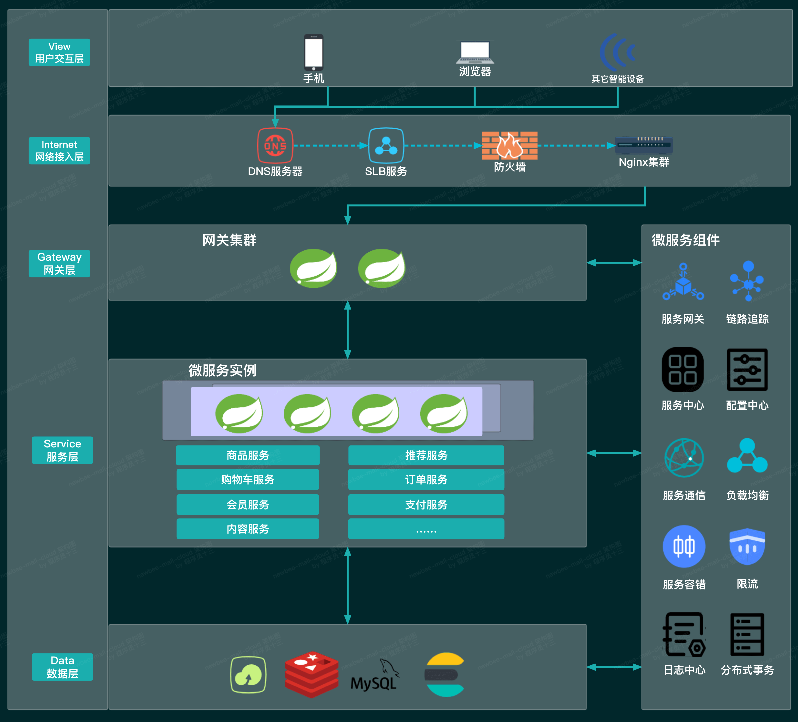

<p align="center">
  
</p>

<h1 align="center">闪票云 — 线上演出票务抢购微服务平台</h1>

<p align="center">
  <strong>基于 Spring Cloud Alibaba 的微服务架构，解决高并发抢票场景下的核心技术难题</strong>
</p>

<p align="center">
  
  
  
  
  
  
  
  
  
</p>

---

## 📸 架构图



---

## 🚀 项目介绍

闪票云是一个**线上演出票务抢购微服务平台**，针对开票瞬间高并发流量做架构优化，解决了票源超售、数据库压力过大、服务雪崩等核心问题。

拆分为**用户服务、票务资源服务、抢购订单服务、消息任务**四大微服务，使用 Spring Cloud Alibaba 全家桶实现服务治理。

> 适用于高并发秒杀、限时抢购、票务系统等场景的架构参考项目。

---

## ✨ 核心能力

| 能力 | 实现方案 |
|------|---------|
| 🎫 **高并发抢票** | Redis 缓存预热 + Lua 脚本保证库存扣减原子性 |
| 🔒 **防超售** | Redis 分布式锁 + Redisson，防止一票多抢 |
| 📊 **流量削峰** | RabbitMQ 异步生成订单，平滑处理峰值流量 |
| 🛡️ **服务保护** | Sentinel 限流熔断，保护核心抢票接口 |
| ⏱️ **超时回收** | XXL-JOB 定时任务自动回收超时未付款门票 |
| 💾 **缓存保护** | 缓存穿透、击穿、雪崩全套解决方案 |
| 📋 **订单状态机** | 订单全生命周期管理（创建→支付→完成/取消） |
| 🔗 **分布式事务** | Seata AT 模式保障跨服务数据一致性 |

---

## 🏗️ 技术栈

| 技术 | 用途 |
|------|------|
| Spring Cloud Alibaba | 微服务治理框架 |
| Nacos | 服务注册与配置中心 |
| Sentinel | 流量控制与熔断降级 |
| Seata | 分布式事务 |
| Gateway | API 网关（路由、鉴权、限流） |
| OpenFeign | 声明式服务调用 |
| Redis + Redisson | 缓存、分布式锁、Lua 脚本 |
| RabbitMQ | 异步消息、流量削峰 |
| MySQL + MyBatis-Plus | 数据持久化 |
| XXL-JOB | 分布式定时任务 |

---

## 📁 微服务模块

```
闪票云/
├── flash-ticket-service/    # 票务资源服务
│   ├── flash-ticket-api     #   ├── Feign 接口定义
│   └── flash-ticket-web     #   └── 控制层 / 业务层
├── flash-order-service/     # 抢购订单服务
│   ├── flash-order-api      #   ├── Feign 接口定义
│   └── flash-order-web      #   └── 控制层 / 业务层
├── flash-user-service/      # 用户服务
│   ├── flash-user-api       #   ├── Feign 接口定义
│   └── flash-user-web       #   └── 控制层 / 业务层
├── gateway-mall/            # 抢购网关（限流 + 鉴权 + 路由）
├── gateway-admin/           # 管理后台网关
├── common/                  # 公共模块
├── static-files/            # 项目文档图片
└── docs/                    # 技术文档
```

---

## 🔄 抢票核心流程

```
用户 → 抢购网关(Sentinel限流) → 订单服务(预检) → Redis(Lua扣库存)
                                                          ↓
                                                    成功 → RabbitMQ → 异步落单
                                                          ↓
                                                    失败 → 返回余票不足
```

### 秒杀关键设计

| 挑战 | 解决方案 |
|------|---------|
| **高并发读** | 票量数据预热到 Redis，读请求不进 DB |
| **库存超卖** | Lua 脚本保证库存扣减原子性 |
| **一票多抢** | Redis 分布式锁 + 用户维度防重复 |
| **数据库风暴** | RabbitMQ 异步落库，DB 端合并写入 |
| **服务雪崩** | Sentinel 线程数/信号量隔离 + 熔断降级 |

---

## 🛠️ 快速启动

### 环境要求

- JDK 21+
- Maven 3.6+
- MySQL 8.0+
- Redis 7+
- RabbitMQ 3.12+
- Nacos 2.3+
- Sentinel Dashboard（可选）
- XXL-JOB Admin（可选）

### 启动步骤

#### 1. 启动基础设施

```bash
# Nacos（服务注册与配置中心）
docker run -d --name nacos -p 8848:8848 -e MODE=standalone nacos/nacos-server:v2.2.3

# Redis
docker run -d --name redis -p 6379:6379 redis:7-alert

# RabbitMQ
docker run -d --name rabbitmq -p 5672:5672 -p 15672:15672 rabbitmq:3.12-management
```

#### 2. 创建数据库

分别创建以下数据库：
- `flash_ticket`（票务资源）
- `flash_order`（订单）
- `flash_user`（用户）

#### 3. 启动微服务

按以下顺序启动：

```bash
# 1. 用户服务
cd flash-user-service/flash-user-web
mvn spring-boot:run

# 2. 票务资源服务
cd flash-ticket-service/flash-ticket-web
mvn spring-boot:run

# 3. 抢购订单服务
cd flash-order-service/flash-order-web
mvn spring-boot:run

# 4. 网关
cd gateway-mall
mvn spring-boot:run
```

---

## 📊 项目亮点（面试用）

- ✅ **完整微服务架构** — Nacos + Gateway + Sentinel + Seata 全家桶
- ✅ **高并发秒杀设计** — Redis 预热 → Lua 扣库存 → MQ 异步落库 → Sentinel 限流
- ✅ **分布式事务** — Seata AT 模式保障跨服务最终一致性
- ✅ **缓存保护策略** — 穿透/击穿/雪崩 全套解决方案
- ✅ **订单状态机** — 状态枚举 + 状态流转校验，代码清晰可维护

---

## 🧪 测试

```bash
mvn test -pl flash-order-service/flash-order-web
```

---

## 📖 技术文档

更多技术细节请参考 `docs/` 目录下的文档。
